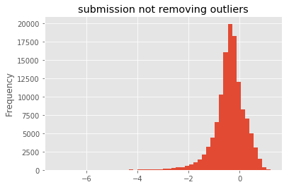
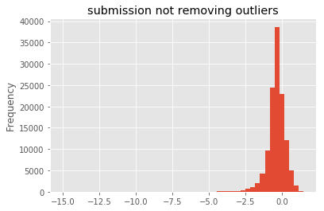

# Kaggle Elo Merchant Category Recommendation
This is the repo for Kaggle's Elo Merchant Category Recommendation. The Kaggle competition page can be found in [the link here.](https://www.kaggle.com/c/elo-merchant-category-recommendation)

## Problem Description
The model will predict a loyalty score for each `card_id` based on the the customer features and merchant transaction history. 

## Data Description
- train.csv - The training data set
  - `first_active_month`: Card first active month
  - `card_id`: Card identifier
  - `feature_1`: Customer feature 1
  - `feature_2`: Customer feature 2
  - `feature_3`: Customer feature 3
  - `target`: Customer loyalty score
- test.csv - The test data set
  - `first_active_month`: Card first active month
  - `card_id`: Card identifier
  - `feature_1`: Customer feature 1
  - `feature_2`: Customer feature 2
  - `feature_3`: Customer feature 3
- merchants.csv - Additional information about all merchants / `merchant_id`s in the dataset.
  - `merchant_id`: Unique merchant identifier
  - `merchant_group_id`: Merchant group (anonymized)
  - `merchant_category_id`: Unique identifier for merchant category (anonymized)
  - `subsector_id`: Merchant category group (anonymized)
  - `numerical_1`: Anonymized measure
  - `numerical_2`: Anonymized measure
  - `category_1`: Anonymized category
  - `most_recent_sales_range`: Range of revenue (monetary units) in last active month --> A > B > C > D > E
  - `most_recent_purchases_range`: Range of quantity of transactions in last active month --> A > B > C > D > E
  - `avg_sales_lag3`: Monthly average of revenue in last 3 months divided by revenue in last active month
  - `avg_purchases_lag3`: Monthly average of transactions in last 3 months divided by transactions in last active month
  - `active_months_lag3`: Quantity of active months within last 3 months
  - `avg_sales_lag6`: Monthly average of revenue in last 6 months divided by revenue in last active month
  - `avg_purchases_lag6`: Monthly average of transactions in last 6 months divided by transactions in last active month
  - `active_months_lag6`: Quantity of active months within last 6 months
  - `avg_sales_lag12`: Monthly average of revenue in last 12 months divided by revenue in last active month
  - `avg_purchases_lag12`: Monthly average of transactions in last 12 months divided by transactions in last active month
  - `active_months_lag12`: Quantity of active months within last 12 months
  - `category_4`: Anonymized category
  - `city_id`: City identifier (anonymized)
  - `state_id`: State identifier (anonymized)
  - `category_2`: Anonymized category
- historical_transactions.csv - Up to 3 months' worth of historical transactions for each `card_id`
  - `authorized_flag`: 'Y' if approved, 'N' if denied
  - `card_id`: Card identifier
  - `city_id`: City identifier (anonymized)
  - `category_1`: Anonymized category
  - `installments`: Number of installments of purchase
  - `category_3`: Anonymized category
  - `merchant_category_id`: Unique identifier for merchant category (anonymized)
  - `merchant_id`: Unique merchant identifier
  - `month_lag`: Month lag to reference date
  - `purchase_amount`: Normalized purchase amount
  - `purchase_date`: Purchase date
  - `category_2`: Anonymized category
  - `state_id`: State identifier (anonymized)
  - `subsector_id`: Merchant category group (anonymized)
- new_merchant_transactions.csv - Two months' worth of data for each `card_id` containing ALL purchases that `card_id` made at `merchant_id`s that were not visited in the historical data.
  - `authorized_flag`: 'Y' if approved, 'N' if denied
  - `card_id`: Card identifier
  - `city_id`: City identifier (anonymized)
  - `category_1`: Anonymized category
  - `installments`: Number of installments of purchase
  - `category_3`: Anonymized category
  - `merchant_category_id`: Unique identifier for merchant category (anonymized)
  - `merchant_id`: Unique merchant identifier
  - `month_lag`: Month lag to reference date
  - `purchase_amount`: Normalized purchase amount
  - `purchase_date`: Purchase date
  - `category_2`: Anonymized category
  - `state_id`: State identifier (anonymized)
  - `subsector_id`: Merchant category group (anonymized)
- sample_submission.csv - A sample submission file in the correct format which contains all card_ids you are expected to predict for.
  - `card_id`: Card identifier
  - `target`: Customer loyalty score

## Some Insights on the Data

- Referenced from:
  - [Welcome to Elo competition!](https://www.kaggle.com/c/elo-merchant-category-recommendation/discussion/72993)

- "Evaluation period" in target description is the period in which new merchant transactions happen. The loyalty score is calculated after historical and evaluation transaction period are given in order to avoid data leakage.

- This competition is not a traditional collaborative filtering/recommendation system challenge since we don’t have a direct definition of what is great merchant or experience. Despite that, we want to link historical information of merchants visits and purchases to a loyalty score, which is basically a business metric that considered both future spending and retention as main components. We expect you to link this information in order to find what triggers higher loyalty scores and you can use any kind of modeling, including recommendation system, but not exclusively. You can be as creative as you want!

- The loyalty score has little, if anything, to do with the data we have been given. Elo wants to see if the transaction and merchant data they have can be used to predict this loyalty score. And I think we can use the given data and external data in any way we choose.

- For the transaction data files, ignore the descriptions on the data page. No one can figure out what they mean. I combined the historical and new files and used the complete file to build aggregates and other features. You need to be careful about the mysterious reference date when doing this - some cards have different reference dates than others.

- Reference date. I believe this is the date that the loyalty score was calculated. There is no information (that I have seen) that states when the reference date is. I used month_lag to determine the "reference month" for each card (reference_month = purchase_date_month - month_lag). Then I defined the reference date as the last day of the reference month, but there are other ways to do it also.

- Merchants. The merchant data is a little messy as there are disconnects between the merchant file and the merchant columns in the transaction data. This is a very real-world problem and you'll have to decide which file to go with. I deleted the common columns out of the transaction data and then replaced them using the merchants file (then both agree and every merchant has one subsector, city, state, etc.). That is one way, but may not be the best way, to proceed.

## Exploratory Data Analysis
The `features` in train and test data set have similar distributions.
- `feature_1` has 5 unique values.
- `feature_2` has 3 unique values.
- `feature_3` has 2 unique values.

The `first_active_month` in in train and test data set have similar distributions.
- More customers are active in the recent years.
- Distribution is very skewed towards years 2016 - 2018.

The `target` value in train data set is normally distrubited with some outliers.
- The target variable is normally distributed around zero.
- There are some very low loyalty scores below -30.

The `authorized_flag` is in both historical and new transactions.
- There are two categories: 'Y', 'N' in both historical and new transactions.
- Most of the transactions are authorized in historical transactions.
- All transactions are authorized 'Y' in the new transactions.

The `installments` is in both historical and new transactions.
- Most of the installments have values of 0 and 1 in both historical and new transactions.
- The values of -1 and 999 seem to be outliers.

The `category_1` is in both historical and new transactions.
- There are two categories: 'Y' and 'N' in both historical and new transactions. 
- Most of the categories have values 'N' in both historical and new transactions.

The `category_2` is in both historical and new transactions.
- There are five categories: 1, 2, 3, 4, 5 in both historical and new transactions. 
- Most of the categories have values 1 in both historical and new transactions with some missing values denoted as -999.

The `category_3` is in both historical and new transactions.
- There are three categories: 'A', 'B', 'C' in both historical and new transactions.
- Most of the categories have values 'A' and 'B' in both historical and new transactions with some missing values denoted as 'X'.

The `category_4` is from merchant data.
- There are two categories: 'Y', 'N' in merchant data with 'N' significantly more.

The `subsector_id` is in both historical and new transactions.
- The distributions are similar in both historical and new transactions with some differences.

The `merchant_category_id` is in both historical and new transactions.
- The distributions are different in historical and new transactions.
- This feature constains too many granular levels of data.

The `city_id` is in both historical and new transactions.
- The distributions are different in historical and new transactions.
- This feature constains too many granular levels of data.

The `state_id` is in both historical and new transactions.
- The distributions are similar in historical and new transactions.
- This feature constains too many granular levels of data.

The `month_lag` is in both historical and new transactions.
- The distributions are very different in historical and new transactions.
- The month lags seem to depend on a certain reference date.

The `purchase_amount` is in both historical and new transactions.
- 98.8% purchase amount falls with [-0.75, 1] in historical transactions.
- 98.6% purchase amount falls with [-0.75, 1] in new transactions.
- Although this is a normalized value, some outliers are very large, i.e., 6010603.9717525.

The `purchase_date` is in both historical and new transactions.
- The purchase date cuts off around a certain reference date for historical and new transactions.

The `hist_trans_dow` is derived from `purchase_date` in both historical and new transactions.
- The purchase day of week follows an increasing trend from Sunday to Saturday in both historical and new transactions.

The `trans_hour` is derived from `purchase_date` in both historical and new transactions.
- The purchase hour seems to peak around noon with shoulders on morning and evenings.

## Data Processing and Feature Engineering
- Reduce memory footprint by optimizing data types.
- Process outliers with respect to `target` in train.csv.
- Fill in logic for NA values in the features.
- Create new features from historical_transactions.csv
- Create new features from new_merchant_transactions.csv
- Feature Importance

- Feature Selection

## Parameter Tuning and Model Evaluation
- LightGBM
  - 5-Fold CV
  - Testing RMSE: [3.78165, 3.72946, 3.76188, 3.75762, 3.81691]
  - Public LB Score: 3.841

- XGBoost
  - Number of boosting rounds 43
  - Training RMSE: 3.572817
  - Testing RMSE: 3.803299
  - Public LB Score: 3.882

## Reference
- [Starter EDA + XGBoost of Elo Merchant Data](https://www.kaggle.com/robikscube/starter-eda-xgboost-of-elo-merchant-data)
- [Simple Exploration Notebook - Elo](https://www.kaggle.com/sudalairajkumar/simple-exploration-notebook-elo)
- [Kaggle Beginner: LGBM Starter](https://www.kaggle.com/bgrad3031/kaggle-beginner-lgbm-starter)
- [Reducing Memory Footprint](https://www.kaggle.com/rahulahuja010/reducing-memory-footprint)
- [Reducing memory use of Transactions df by 12x](https://www.kaggle.com/poedator/reducing-memory-use-of-transactions-df-by-12x)
- [Simple LightGBM without blending](https://www.kaggle.com/mfjwr1/simple-lightgbm-without-blending)
- [Some tips](https://www.kaggle.com/c/elo-merchant-category-recommendation/discussion/78058)
- [Target - true meaning revealed!](https://www.kaggle.com/raddar/target-true-meaning-revealed/)
- [Towards de-anonymizing the data! Some insights](https://www.kaggle.com/raddar/towards-de-anonymizing-the-data-some-insights)
- [Feature Engineering on multiple reference dates.](https://www.kaggle.com/rajeshcv/feature-engineering-on-multiple-reference-dates)
- [Boruta feature elimination](https://www.kaggle.com/tilii7/boruta-feature-elimination)
- [Feature Selection with Null Importances](https://www.kaggle.com/ogrellier/feature-selection-with-null-importances)
- [Hyperparameter tuning](https://www.kaggle.com/fabiendaniel/hyperparameter-tuning)
- [A Tutorial of Model Monotonicity Constraint Using Xgboost](https://xiaoxiaowang87.github.io/monotonicity_constraint/)
- [A template for my python machine learning projects](https://github.com/mengdong/python-ml-structure)
- [Template codes and examples for Python machine learning concepts](https://github.com/yuxiangdai/machine-learning-templates)
- [Your First Machine Learning Project in Python Step-By-Step](https://machinelearningmastery.com/machine-learning-in-python-step-by-step/)
- [Complete Guide to Parameter Tuning in XGBoost (with codes in Python)](https://www.analyticsvidhya.com/blog/2016/03/complete-guide-parameter-tuning-xgboost-with-codes-python/)
- [A Comprehensive Guide to Ensemble Learning (with Python codes)](https://www.analyticsvidhya.com/blog/2018/06/comprehensive-guide-for-ensemble-models/)
- [Model Evaluation, Model Selection, and Algorithm Selection in Machine Learning](https://arxiv.org/pdf/1811.12808.pdf)
- [How to Build a Recommendation System for Purchase Data](https://medium.com/datadriveninvestor/how-to-build-a-recommendation-system-for-purchase-data-step-by-step-d6d7a78800b6)
- [Comprehensive Guide to build a Recommendation Engine from scratch (in Python)](https://www.analyticsvidhya.com/blog/2018/06/comprehensive-guide-recommendation-engine-python/)
