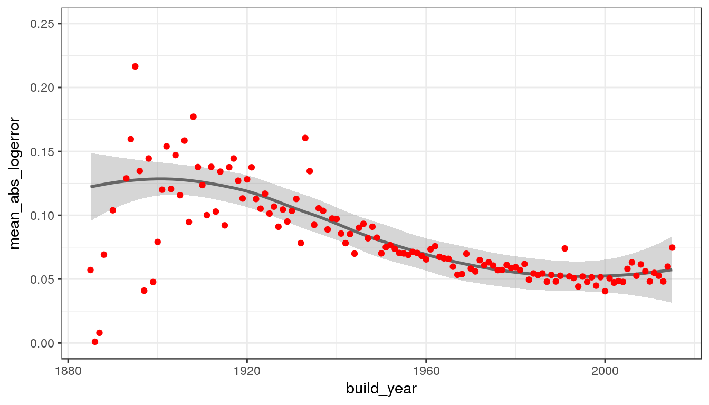
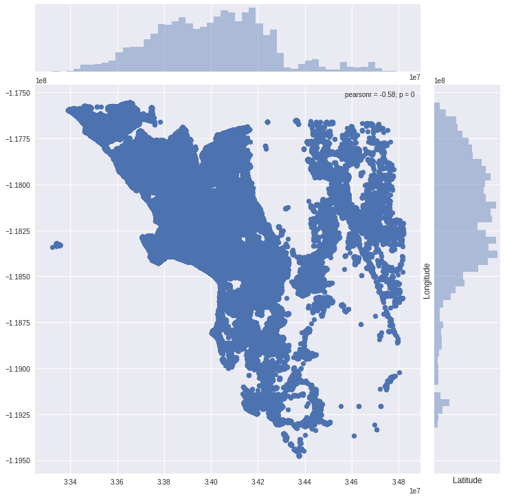
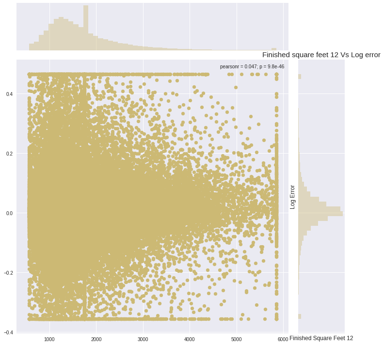
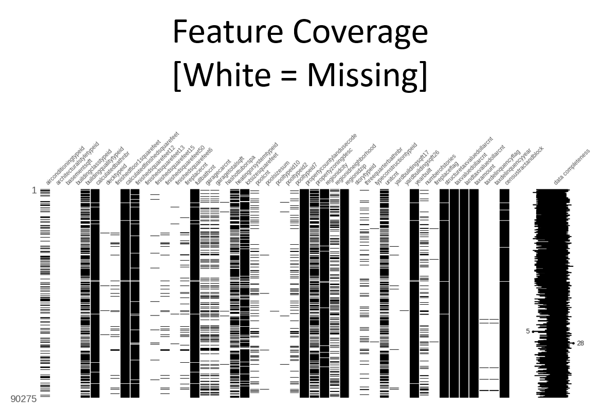

# Literature Review

Competition is regression based. So the following only focuses on regression based reference.

List of regression-based competitions:
- [House Prices: Advanced Regression Techniques (RMSE)](https://www.kaggle.com/c/house-prices-advanced-regression-techniques)
- [New York City Taxi Fare Prediction (RMSE)](https://www.kaggle.com/c/new-york-city-taxi-fare-prediction)
- [Corporación Favorita Grocery Sales Forecasting (NWRMSLE)](https://www.kaggle.com/c/favorita-grocery-sales-forecasting)
- [Zillow Prize: Zillow’s Home Value Prediction (Zestimate)  (MAE)](https://www.kaggle.com/c/zillow-prize-1)
- [Mercedes-Benz Greener Manufacturing (R^2)](https://www.kaggle.com/c/mercedes-benz-greener-manufacturing)
- [Allstate Claims Severity (MAE)](https://www.kaggle.com/c/allstate-claims-severity)
- [How Much Did It Rain? II (MAE)](https://www.kaggle.com/c/how-much-did-it-rain-ii)
- [Caterpillar Tube Pricing (RMSLE)](https://www.kaggle.com/c/caterpillar-tube-pricing)
- [Walmart Recruiting II: Sales in Stormy Weather (RMSLE)](https://www.kaggle.com/c/walmart-recruiting-sales-in-stormy-weather)
- [PUBG Finish Placement Prediction (Kernels Only)  (MAE)](https://www.kaggle.com/c/pubg-finish-placement-prediction)
- [Grupo Bimbo Inventory Demand (RMSLE)](https://www.kaggle.com/c/grupo-bimbo-inventory-demand)
- [The Winton Stock Market Challenge (WMAE)](https://www.kaggle.com/c/the-winton-stock-market-challenge)
- [ECML/PKDD 15: Taxi Trip Time Prediction (II)  (RMSLE)](https://www.kaggle.com/c/pkdd-15-taxi-trip-time-prediction-ii)
- [Bike Sharing Demand (RMSLE)](https://www.kaggle.com/c/bike-sharing-demand)
- [Avito Demand Prediction Challenge (RMSE)](https://www.kaggle.com/c/avito-demand-prediction)
- [Santander Value Prediction Challenge (RMSLE)](https://www.kaggle.com/c/santander-value-prediction-challenge)
- [Sberbank Russian Housing Market (RMSLE)](https://www.kaggle.com/c/sberbank-russian-housing-market)
- [Restaurant Revenue Prediction (RMSE)](https://www.kaggle.com/c/restaurant-revenue-prediction)
- [Google Analytics Customer Revenue Prediction (RMSE)](https://www.kaggle.com/c/ga-customer-revenue-prediction)
- [Rossmann Store Sales (RMSPE)](https://www.kaggle.com/c/rossmann-store-sales)

## 1. Kernels and Discussion

### 1a. Kernels/Discussion in the competition
- [Elo Merchant Category Recommendation: Combining your model with a model without outlier](https://www.kaggle.com/waitingli/combining-your-model-with-a-model-without-outlier) <br/>
   - Build a training model without outlier, another model to evaluate likelihood of and to classify outliers, get rid of the outliers with top 10% likelihood and combine submission
- [Elo Merchant Category Recommendation: LIghtGBM (GBDT + RF) Baysian Ridge Reg: LB 3.61](https://www.kaggle.com/ashishpatel26/lightgbm-gbdt-rf-baysian-ridge-reg-lb-3-61) <br/>
   - good script on reducing memory usage
   - good script on generating features - count, sum, mean, min, max, std
   - good illustration on feature importance
   - good use of `n_repeats` during CV
   - stacking using `BayesianRidge()`
- [Elo world](https://www.kaggle.com/fabiendaniel/elo-world)
   - Manual features: month_diff
   - Good script of generating features
   - [numpy.ptp](https://docs.scipy.org/doc/numpy-1.15.0/reference/generated/numpy.ptp.html) for finding date range
- [Elo Merchant Category Recommendation: Sharing of my experience so far](https://www.kaggle.com/c/elo-merchant-category-recommendation/discussion/75935) <br/>
   - Feature engineering
   - Feature selection
   - Get your basics right
   - Think "out-of-box"
   - Manage your code
   
### 1b. Kernels/Discussion in other competitions

#### House Prices: Advanced Regression Techniques (RMSE)
- [All You Need is PCA (LB: 0.11421, top 4%)](https://www.kaggle.com/massquantity/all-you-need-is-pca-lb-0-11421-top-4) <br/>
   - "year" is regarded as categorical but not numerical features
   - Good table on showing mean, median and count using groupby
   - Using pandas.qcut to discretize the continuous feature to 10 parts
- [Top 10 (0.10943): stacking, MICE and brutal force](https://www.kaggle.com/agehsbarg/top-10-0-10943-stacking-mice-and-brutal-force) </br>
   - **I spent a lot of time and submissions to fine-tune parameters (best improvement was by tuning min_samples_leaf and min_samples_split for GradientBoostingRegressor)**
   - Very good script, important
   - Very simple method of handling missing data turns out to be great
   - The author plotted the predictions and investigated further - It was obvious from that picture that for small final predictions we are overestimating sales, for big values of predictions we are underestimating.
   - Used 30-fold CV
   - Good code of manually converting numerical features to categorical (or other way round)
   - **Got function to add log and squared features conveniently**
- [Hybrid SVM Benchmark Approach [0.11180] LB: Top 2%](https://www.kaggle.com/couyang/hybrid-svm-benchmark-approach-0-11180-lb-top-2) <br/>
   - Kernel written in R
- [Top 2% from Laurenstc on house price prediction](https://www.kaggle.com/hemingwei/top-2-from-laurenstc-on-house-price-prediction) <br/>
   - Explanation is not clear in this kernel
   - Generate new features such as Total_Bathroom = FullBath + 0.5 * HalfBath
   - Simplify features by making them categorical
- [Sharing my approach to motivate more discussions](https://www.kaggle.com/c/house-prices-advanced-regression-techniques/discussion/23409) <br/>
   - Models tuned by Bayesian optimization (script is [here](https://www.kaggle.com/tilii7/svr-sparse-matrix-bayesian-optimization) and [here](https://www.kaggle.com/tilii7/krr-sparse-matrix-bayesian-optimization))
   - Can try kernel ridge regression
   - Can try **outlier test in the scipy statsmodels package** (with 0.99 confidence level / [ref 1](https://stackoverflow.com/questions/10231206/can-scipy-stats-identify-and-mask-obvious-outliers), [ref 2](https://quantoid.net/files/702/lecture9.pdf)) 
- [the secret to making good predictions](https://www.kaggle.com/c/house-prices-advanced-regression-techniques/discussion/32381) <br/>
   - it simply suggests ensemble/stacking
- [Dealing with Missing Data in the Test Dataset](https://www.kaggle.com/c/house-prices-advanced-regression-techniques/discussion/35968) <br/>
   - can try missing value imputation (MVI)
- [Lessons learned from 1st Kaggle Compeitition](https://www.kaggle.com/c/house-prices-advanced-regression-techniques/discussion/40391) <br/>
   - Instead of using mean/median, may replace with all 0s or individually examine each NaN for an appropriate substitute
   - Feature selection: methods not clear though
   - Log transform target and unskew features
   - Feature normalization not so good indeed
   - Optimizing hyperparameters proved easy when using CV
   - [Related script](https://www.kaggle.com/nottold/naive-ensemble-model-ridge-lasso): Code is very structured
- [A study on Regression applied to the Ames dataset](https://www.kaggle.com/juliencs/a-study-on-regression-applied-to-the-ames-dataset) <br/>
   - Manual remove two extreme outliers by visual inspection
   - Add interaction terms
   - Create polynomial features (for numerical features)
   - Replace missing values for numerical features by using median as replacement
   - Log transform of the skewed numerical features to lessen impact of outliers
   - Create dummy features for N/A values with one-hot features
   - Standardize features (StandardScaler)
   - Plot residuals and coefficients/importance in the model
   - Two layers of parameter tuning - a big grid, and then a finer grid
- [Comprehensive data exploration with Python](https://www.kaggle.com/pmarcelino/comprehensive-data-exploration-with-python) <br/>
   - Steps: 1) Understand problem 2) Univariable study 3) Multivarate study 4) Basic cleaning 5) Test assumptions
   - Check distribution of target (+ve skewness and peakedness)
   - Check relationship between categorical variables and target
   - Check relationship between numerical variables and target
   - Plot correlation map to check **multicollinearity**
   - Plot scatter plots between features and target
   - Good way to display missing data situation
   - Good way to handle outlier (univariate and mulitvariate)
   - Plot target distribution (peakedness and +ve skewness)
   - Log transformation for zero values ([Ref](https://discuss.analyticsvidhya.com/t/methods-to-deal-with-zero-values-while-performing-log-transformation-of-variable/2431))
   - Check homoscedasticity (conic shape in scatter plots between target and feat)
- [Stacked Regressions : Top 4% on LeaderBoard](https://www.kaggle.com/serigne/stacked-regressions-top-4-on-leaderboard) <br/>
   - Manual remove two extreme outliers by visual inspection
   - Plot target distribution and QQ-plot and apply log-transformation
   - Good graph on showing missing data by sorted percentage 
   - Check what N/A means for each feature and handle accordingly (fill N/A with "None", median value, etc.)
   - Transform numerical variables that are really categorical
   - Manual generate one feature of total area since it is important for determining house prices
   - Check skewness of features and apply box-cox transformation of (highly
   - Scale features using statistics that are robust to outliers using [RobustScaler](https://scikit-learn.org/stable/modules/generated/sklearn.preprocessing.RobustScaler.html)
   - [**Stacking**](http://blog.kaggle.com/2017/06/15/stacking-made-easy-an-introduction-to-stacknet-by-competitions-grandmaster-marios-michailidis-kazanova/) can mean 1) taking average of the predictions and 2) using the predicted target as feature and train another meta-model fo prediction
- [Regularized Linear Models](https://www.kaggle.com/apapiu/regularized-linear-models) <br/>
   - Plot the validation plot of rmse against alpha - good plot
   - Plot feature importance 
   
#### New York City Taxi Fare Prediction (RMSE)
- [NYC Taxi Fare - Data Exploration](https://www.kaggle.com/breemen/nyc-taxi-fare-data-exploration) <br/>
   - **Extremely nice analysis**
   - eliminate data points with negative `fare_amount`
   - plot the target distribution (fare) and is similar to our situation of having outliers
   - Removing datapoints in water
   - Very nice map visualization
   - **You always need to have some basic 'intuition' and you test/verify it through histogram**
   - Thoroughly investigate different situations (e.g. >50 miles with low fare, 0 distance with a non-zero fare)
   - Use of colormap `cmap='viridis'`
   - **Very nice plot of RMSE training vs RMSE testing**
      <p align="center">    </p>
- [Python Version of Top Ten Rank R 22 M (2.88)](https://www.kaggle.com/jsylas/python-version-of-top-ten-rank-r-22-m-2-88) <br/>
   - Clean outlier (fare < 0, fare > 500)
   - Use haversine distance to calculate distance between two points on earth
   - Not sure what bearing distance is
   - Use lightgbm
- [EDA+ Data Cleaning + XG Boost](https://www.kaggle.com/sandeepkumar121995/eda-data-cleaning-xg-boost) <br/>
   - notice maximum passenger count is 208 - odd
   - use correlation to evaluate relationship between fare amount and passenger count
   - drop 527 observations where fare amount is higher than 100 dollars and distance covered is less than 1 miles
   - use xgboost and plot feature importance (plot not good looking though)
- [Ideas for Improvement](https://www.kaggle.com/c/new-york-city-taxi-fare-prediction/discussion/62393)
   - Use more columns from the input data. Try to see if the other columns -- pickup_datetime and passenger_count -- can help improve your results.
   - Use a non-linear model to capture more intricacies within the data.
   - Try to find more outliers to prune, or construct useful **[feature crosses](https://developers.google.com/machine-learning/crash-course/feature-crosses/encoding-nonlinearity)**.
   - Use the entire dataset -- most we're only using about 20% of the training data!
   - Use **Dask** package for data analysis
- [Machine Learning to Predict Taxi Fare — Part One : Exploratory Analysis](https://medium.com/analytics-vidhya/machine-learning-to-predict-taxi-fare-part-one-exploratory-analysis-6b7e6b1fbc78) <br/>
   - Nice EDA (code available)
- [Machine Learning to Predict Taxi Fare — Part Two: Predictive Modelling](https://medium.com/analytics-vidhya/machine-learning-to-predict-taxi-fare-part-two-predictive-modelling-f80461a8072e) <br/>
   - Basic script for modeling (not so helpful)
- [Python Version of Top Ten Rank R 22 M (2.88)](https://www.kaggle.com/jsylas/python-version-of-top-ten-rank-r-22-m-2-88) <br/>
   - No EDA at all
   - Not much explanation but very clean

#### Corporación Favorita Grocery Sales Forecasting (NWRMSLE)
- [Shopping for Insights - Favorita EDA](https://www.kaggle.com/headsortails/shopping-for-insights-favorita-eda) <br/>
   - Script written in R, not so helpful
   - Can try plotting tree map
   <p align="center">    </p>
   - Good illustration on time series forecast - split of training/testing data
   <p align="center">    </p>
   - Unbinned curve is good
   <p align="center">    </p>
   - Scatter cloud is good
   <p align="center">    </p>
   - Ridgeline plot is good
   <p align="center">    </p>
   - Overview count plot is good
   <p align="center">    </p>
- [Comprehensive Python and D3.js Favorita analytics](https://www.kaggle.com/arthurtok/comprehensive-python-and-d3-js-favorita-analytics) <br/>
   - Very nice analysis
   - **Check null, missing values and NaN**
   - Check holiday and special events
   - Use Plotly to create interactive visualiations
   - Nice map and code for treemap
   <p align="center">    </p>
   - Nice seaborn heatmap on store numbers and the assigned clusters
   <p align="center">    </p>
   - Good visualizations on Stacked Barplots of Types against clusters
   <p align="center">  </p>
   - Very nice plot for "Displaying the HTML and D3 visuals on IPython notebook" (search the bold term) <br/>
   - One thing inspired from the plots is to cross-check distribution between training and testing data
- [A Very Extensive Favorita Exploratory Analysis](https://www.kaggle.com/captcalculator/a-very-extensive-favorita-exploratory-analysis) <br/>
   - written in R, not that useful
   - Visualization not as extensive as [Shopping for Insights - Favorita EDA](https://www.kaggle.com/headsortails/shopping-for-insights-favorita-eda)
- [Memory optimization and EDA on entire dataset](https://www.kaggle.com/jagangupta/memory-optimization-and-eda-on-entire-dataset) <br/>
   - following are the steps I've used to reduce memory consumption
      - Check the range of values stored in the column
      - Check the suitable datatype from the following link https://docs.scipy.org/doc/numpy-1.13.0/user/basics.types.html
      - Change datatype
      - split date col into three columns
      - There are two reasons to do this
      - In pandas any operation on column of type "datetime" is not vectorized.Hence any operations on it will take more time
      - Splitting it into three columns will provide better memory utilization. Eg: in the test dataset date col uses approx. 25 mb while storenbr(uint8) uses approx. 3 mb
      - Impute on promo col
      - join everything
   - the groupby table of `Performance of Item families across stores of different type` and `Top 20 Item classes(by overall sales)` are nice
- [1st place solution](https://www.kaggle.com/c/favorita-grocery-sales-forecasting/discussion/47582#latest-360306) <br/>
   - no need to use all data as training - only data in 2017 was used 
   - tried to use more data but failed
   - filled missing or negtive promotion and target values with 0
   - nice feature engineering part
      - basic features
         - category features: store, item, famlily, class, cluster…
         - promotion
         - dayofweek(only for model 3)
      - statitical features: we use some methods to stat some targets for different keys in different time windows
         - time windows
            - nearest days: [1,3,5,7,14,30,60,140]
            - equal time windows: [1] * 16, [7] * 20…
         - key：store x item, item, store x class
         - target: promotion, unit_sales, zeros
         - method
            - mean, median, max, min, std
            - days since last appearance
            - difference of mean value between adjacent time windows(only for equal time windows)
      - useless features
         - holidays
         - other keys such as: cluster x item, store x family…
   - Single model
      - model_1 : 0.506 / 0.511 , 16 lgb models trained for each day source code
      - model_2 : 0.507 / 0.513 , 16 nn models trained for each day source code
      - model3 : 0.512 / 0.515，1 lgb model for 16 days with almost same features as model1
      - model_4 : 0.517 / 0.519，1 nn model based on @sjv's code
   - Ensemble
      - Stacking doesn't work well this time, our best model is linear blend of 4 single models. 
      - final submission = 0.42*model1 + 0.28 * model2 + 0.18 * model3 + 0.12 * model4 
      - public = 0.504 , private = 0.509
- [2nd place solution overview](https://www.kaggle.com/c/favorita-grocery-sales-forecasting/discussion/47568) <br/>
   - During the training, we set the learning rate as 0.0005 and with a learning decay.
   - Apporach worth re-reading for time-series (or time series) competitions
- [3rd place solution overview](https://www.kaggle.com/c/favorita-grocery-sales-forecasting/discussion/47560#latest-302253) <br/>
   - Ensemble of CNN, LSTM and GRU
   - When it comes to time series, I strongly belive that the two most important things are validation and bagging. By correct validation I mean simulating train/test (train/unknown future) split to avoid any kind of future information leaks. Thus, the validation set should include a time period that is not present in train in any way, even with different timeseries, because these time series could correlate with each other.
- [4th-Place Solution Overview](https://www.kaggle.com/c/favorita-grocery-sales-forecasting/discussion/47529) <br/>
   - Write up quite short
   - Used autoencoder + bidirectional LSTM (crazy)
   - [Similar code for web traffic forecasting used in this competition](https://github.com/sjvasquez/web-traffic-forecasting)
- [5th Place Solution](https://www.kaggle.com/c/favorita-grocery-sales-forecasting/discussion/47556) <br/>
   - Used LGBM, CNN+DNN, and RNN
   - [Github link](https://github.com/LenzDu/Kaggle-Competition-Favorita)
- [8th solution](https://www.kaggle.com/c/favorita-grocery-sales-forecasting/discussion/47564) <br/>
   - Focus on seasonality and missing values
   - Simply use a single NN model

#### Zillow Prize: Zillow’s Home Value Prediction (Zestimate) (MAE)
- [Exploratory Analysis Zillow](https://www.kaggle.com/philippsp/exploratory-analysis-zillow) <br/>
   - written in R script
   - Use absolute log error change to analyze housing price error over time
   - Nice plot on "How does the absolute logerror change with build_year"
   <p align="center">    </p>
   - Very good interactive map visualization with several error measures
- [Simple Exploration Notebook - Zillow Prize](https://www.kaggle.com/sudalairajkumar/simple-exploration-notebook-zillow-prize) <br/>
   - good script of checking existing files in a folder
      ```
      from subprocess import check_output
      print(check_output(["ls", "../input"]).decode("utf8"))
      ```
   - Nice latitude and longitude plot
      <p align="center">  
   - One liner to check missing/null values `missing_df = train_df.isnull().sum(axis=0).reset_index()`
   - EDA consists of **univariate non-graphical, multivariate nongraphical, univariate graphical, and multivariate graphical**.
   - Nice bivariate plot
      <p align="center">  
   - Use extra-tree models for getting non-linear model importance
- [Only_Cat boost (LB : 0.0641 939)](https://www.kaggle.com/abdelwahedassklou/only-cat-boost-lb-0-0641-939) <br/>
   - Python script only, no explanation
   - Use of `low_memory ` option for `pd.read_csv`
   - Regular use of gc to avoid heavy memory use
   - Pretty clean and structured code, good candidate for template
- [XGBoost, LightGBM, and OLS and NN](https://www.kaggle.com/aharless/xgboost-lightgbm-and-ols-and-nn) <br/>
   - Python script only, no explanation
   - Purely running XGBoost, LightGBM, OLS and NN and then ensemble
- [Boost your score with stacknet (0.06433 with another script)](https://www.kaggle.com/c/zillow-prize-1/discussion/39111) <br/>
   - Discussion post
   - Proposes the use of [stacknet](https://github.com/h2oai/pystacknet) 
   - [kaggle official blog post on stacknet](http://blog.kaggle.com/2017/06/15/stacking-made-easy-an-introduction-to-stacknet-by-competitions-grandmaster-marios-michailidis-kazanova/)
   - Discussion centers around the use of stacknet
- [17th Place Solution](https://www.kaggle.com/c/zillow-prize-1/discussion/47434) <br/>
   - **MUST RE-READ, RE-READ AND RE-READ**
   - related kernel - [Zillow EDA On Missing Values & Multicollinearity](https://www.kaggle.com/viveksrinivasan/zillow-eda-on-missing-values-multicollinearity)
   - include a very detailed [powerpoint presentation file](./reference_file/Zilllow Summary Presentation 2018.01.11.pptx)
   - good visualization on missing data
      <p align="center">  
   - **Got a plot for just the correlation of the most important features**
   - Good strategy on feature design
      - basic work(e.g. avg room size, value of structure relative to land)
      - unusual methods
         - neighborhood: basically consider houses with no labels by using **average neighbor** and **constraining relationships for each neighbor** (let's say get the 500 nearest homes)
         - constrained simiarity measures: determine weights to constrain the fitting
      - weak and discarded features
   - Three layers of stacking - very strong and eye-opening
      <p align="center">  
#### Mercedes-Benz Greener Manufacturing (R^2)
- [Simple Exploration Notebook - Mercedes](https://www.kaggle.com/sudalairajkumar/simple-exploration-notebook-mercedes)
- [MercEDAs - update2 - intrinsic noise](https://www.kaggle.com/headsortails/mercedas-update2-intrinsic-noise)
- [Mercedes magic features (Private LB:0.54200)](https://www.kaggle.com/dmi3kno/mercedes-magic-features-private-lb-0-54200)
- [stacked then averaged models [~ Private LB 0.554]](https://www.kaggle.com/adityakumarsinha/stacked-then-averaged-models-private-lb-0-554)
- [1st place solution](https://www.kaggle.com/c/mercedes-benz-greener-manufacturing/discussion/37700)
- [A third place solution](https://www.kaggle.com/c/mercedes-benz-greener-manufacturing/discussion/36126)
- [6th Place solution](https://www.kaggle.com/tobikaggle/stacked-then-averaged-models-0-5697)
- [10th solution, average 4 predictions](https://www.kaggle.com/c/mercedes-benz-greener-manufacturing/discussion/36128)
- [in CV you must trust](https://www.kaggle.com/c/mercedes-benz-greener-manufacturing/discussion/36136)
 
 #### Allstate Claims Severity (MAE)
- [Exploratory study on ML algorithms](https://www.kaggle.com/sharmasanthosh/exploratory-study-on-ml-algorithms)
- [All-Trump-State](https://www.kaggle.com/vishallakha/all-trump-state)
- [my test1](https://www.kaggle.com/pedram/my-test1)
- [#1st Place Solution](https://www.kaggle.com/c/allstate-claims-severity/discussion/26416)
- [#2nd Place Solution](https://www.kaggle.com/c/allstate-claims-severity/discussion/26427)
- [Faron's 3rd Place Solution](https://www.kaggle.com/c/allstate-claims-severity/discussion/26447)

#### How Much Did It Rain? II (MAE)
- [Beware of Outliers !!](https://www.kaggle.com/sudalairajkumar/rainfall-test)
- [38% Missing Data](https://www.kaggle.com/c/how-much-did-it-rain-ii/discussion/16572)
- [Cross Validating](https://www.kaggle.com/c/how-much-did-it-rain-ii/discussion/16680)
- [How Much Did It Rain? II, Winner's Interview: 1st place, PuPa (aka Aaron Sim)](http://blog.kaggle.com/2016/01/04/how-much-did-it-rain-ii-winners-interview-1st-place-pupa-aka-aaron-sim/)
- [1st solution writeup](http://simaaron.github.io/Estimating-rainfall-from-weather-radar-readings-using-recurrent-neural-networks/)
- [1st solution github](https://github.com/simaaron/kaggle-Rain)
- [2nd place, Luis Andre Dutra e Silva](http://blog.kaggle.com/2015/12/17/how-much-did-it-rain-ii-2nd-place-luis-andre-dutra-e-silva/)
- [30th solution github](https://github.com/vopani/Kaggle_Rain2)

#### Caterpillar Tube Pricing (RMSLE)
- [0.2748 with RF and log transformation](https://www.kaggle.com/ademyttenaere/0-2748-with-rf-and-log-transformation)
- [How We Won the Caterpillar Machine Learning Competition at Kaggle](http://mariofilho.com/won-caterpillar-machine-learning-competition-kaggle/)
- [Caterpillar Winners' Interview: 1st place, Gilberto | Josef | Leustagos | Mario](http://blog.kaggle.com/2015/09/22/caterpillar-winners-interview-1st-place-gilberto-josef-leustagos-mario/)
- [7th place writeup](https://weiminwang.blog/2015/09/02/caterpillar-tube-pricing-feature-engineering-and-ensemble-approach/)
- [7th place github](https://github.com/aaxwaz/Caterpillar-Tube-Pricing-Kaggle)
- [Keras starter code](https://www.kaggle.com/fchollet/keras-starter-code)

#### Walmart Recruiting II: Sales in Stormy Weather (RMSLE)
- [Sales in Stormy Weather: Simple writeup by first place](http://analyticscosm.com/secret-sauce-behind-15-kaggle-winning-ideas/)
- [Sales in Stormy Weather: First Place Entry](https://www.kaggle.com/c/walmart-recruiting-sales-in-stormy-weather/discussion/14452#80451)

#### PUBG Finish Placement Prediction (Kernels Only) (MAE)
- [EDA is Fun!](https://www.kaggle.com/deffro/eda-is-fun)
- [Effective Feature Engineering](https://www.kaggle.com/rejasupotaro/effective-feature-engineering)
- [A Simple Post-Processing Trick For NN Models](https://www.kaggle.com/c/pubg-finish-placement-prediction/discussion/70492)

#### Grupo Bimbo Inventory Demand (RMSLE)
- [Exploring products](https://www.kaggle.com/vykhand/exploring-products)
- [Grupo Bimbo data analysis](https://www.kaggle.com/fabienvs/grupo-bimbo-data-analysis)
- [Exploratory Data Analysis](https://www.kaggle.com/anokas/exploratory-data-analysis)
- [#1 Place Solution of The Slippery Appraisals team](https://www.kaggle.com/c/grupo-bimbo-inventory-demand/discussion/23863)
- [#6 Place Solution - Team Gilberto & Regis](https://www.kaggle.com/c/grupo-bimbo-inventory-demand/discussion/23232)
- [#19 place solution](https://www.kaggle.com/c/grupo-bimbo-inventory-demand/discussion/23208)
- [Low Memory Solution](https://www.kaggle.com/c/grupo-bimbo-inventory-demand/discussion/23202)

#### The Winton Stock Market Challenge (WMAE)
- [Winton Stock Market Challenge, Winner's Interview: 3rd place, Mendrika Ramarlina](http://blog.kaggle.com/2016/02/12/winton-stock-market-challenge-winners-interview-3rd-place-mendrika-ramarlina/)
- [Solutions Sharing](https://www.kaggle.com/c/the-winton-stock-market-challenge/discussion/18584#105945)
- [The Winton Stock Market Challenge - Predicting Future (Stock Returns)](http://blog.socratesk.com/kaggle/2016/01/27/Winton-Stock-Market-Challenge)
- [25-30th place solution github](https://github.com/ceshine/kaggle-winton-2016)

#### ECML/PKDD 15: Taxi Trip Time Prediction (II) (RMSLE)
- [Beat The Benchmark](https://www.kaggle.com/willieliao/beat-the-benchmark)
- [Speed visualization](https://www.kaggle.com/wikunia/speed-visualization)
- [Medium: Our Approach — Kaggle : Taxi Trip Time Prediction (II)](https://medium.com/@PrakhashS/our-approach-kaggle-taxi-trip-time-prediction-ii-f5e3e8f3db10)
- [Winning solution github](https://github.com/hochthom/kaggle-taxi-ii)
- [JULIEN PHALIP: Kaggle competition report. ECML PKDD 2015 Taxi Trajectory Prediction](https://www.julienphalip.com/blog/kaggle-competition-report-ecml-pkdd-2015-taxi/)
- [Alexandre de Brébisson: Winning the Kaggle Taxi destination prediction](http://adbrebs.github.io/Kaggle-Taxi-Destination-Prediction/)
- [An Ensemble Learning Approach for the Kaggle Taxi Travel Time Prediction Challenge](https://www.researchgate.net/publication/283123171_An_Ensemble_Learning_Approach_for_the_Kaggle_Taxi_Travel_Time_Prediction_Challenge)


#### Bike Sharing Demand (RMSLE)
- [EDA & Ensemble Model (Top 10 Percentile) ](https://www.kaggle.com/viveksrinivasan/eda-ensemble-model-top-10-percentile)
- [Medium: How to finish top 10 percentile in Bike Sharing Demand Competition In Kaggle? (part -1)](https://medium.com/@viveksrinivasan/how-to-finish-top-10-percentile-in-bike-sharing-demand-competition-in-kaggle-part-1-c816ea9c51e1)
- [Medium: How to finish top 10 percentile in Bike Sharing Demand Competition In Kaggle? (part -2)](https://medium.com/@viveksrinivasan/how-to-finish-top-10-percentile-in-bike-sharing-demand-competition-in-kaggle-part-2-29e854aaab7d)
- [Kaggle Bike Sharing Demand Prediction – How I got in top 5 percentile of participants?](https://www.analyticsvidhya.com/blog/2015/06/solution-kaggle-competition-bike-sharing-demand/)
- [Research paper: weather and DC bikeshare](https://www.kaggle.com/c/bike-sharing-demand/discussion/9457)

#### Avito Demand Prediction Challenge (RMSE)
- [Avito EDA, FE, Time Series, DT Visualization](https://www.kaggle.com/codename007/avito-eda-fe-time-series-dt-visualization)
- [Ideas for Image Features and Image Quality](https://www.kaggle.com/shivamb/ideas-for-image-features-and-image-quality)
- [In-Depth Exploratory Analysis and Visualizations - Avito](https://www.kaggle.com/shivamb/in-depth-analysis-visualisations-avito)
- [Simple Exploration + Baseline Notebook - Avito](https://www.kaggle.com/sudalairajkumar/simple-exploration-baseline-notebook-avito)
- [Kaggle Avito Demand Prediction Challenge: Analysis of Winning Submissions](http://mlexplained.com/2018/08/18/kaggle-avito-demand-prediction-challenge-analysis-of-winning-submissions/)
- [second place solution](https://www.kaggle.com/c/avito-demand-prediction/discussion/59871)
- [3 place solution](https://www.kaggle.com/c/avito-demand-prediction/discussion/59885)
- [4th Place Solution](https://www.kaggle.com/c/avito-demand-prediction/discussion/59881)
- [5th place solution](https://www.kaggle.com/c/avito-demand-prediction/discussion/59914)


#### Santander Value Prediction Challenge (RMSLE)
- [Winner Solution - Giba & Lucasz](https://www.kaggle.com/c/santander-value-prediction-challenge/discussion/65272)
- [21st place solution (bug fixed) [private: 0.52785]](https://www.kaggle.com/rsakata/21st-place-solution-bug-fixed-private-0-52785)
- [[0.49-PublicLB]Simple_Blend(Private_LB_rank_126th)](https://www.kaggle.com/khahuras/0-49-publiclb-simple-blend-private-lb-rank-126th)
- [#1 Solution: Leak Part](https://www.kaggle.com/c/santander-value-prediction-challenge/discussion/63931)
- [Winner #1 Position Mini Writeup](https://www.kaggle.com/c/santander-value-prediction-challenge/discussion/63907)
- [2nd place solution overview](https://www.kaggle.com/c/santander-value-prediction-challenge/discussion/63848)
- [5 place mini write-up](https://www.kaggle.com/c/santander-value-prediction-challenge/discussion/63822)
- [Special Sauce - the Santander Process is a Time Series](https://www.kaggle.com/c/santander-value-prediction-challenge/discussion/61396)

#### Sberbank Russian Housing Market (RMSLE)
- [A Very Extensive Sberbank Exploratory Analysis](https://www.kaggle.com/captcalculator/a-very-extensive-sberbank-exploratory-analysis)
- [Simple Exploration Notebook - Sberbank](https://www.kaggle.com/sudalairajkumar/simple-exploration-notebook-sberbank)
- [1st place solution](https://www.kaggle.com/c/sberbank-russian-housing-market/discussion/35684)
- [15th place solution](https://www.kaggle.com/c/sberbank-russian-housing-market/discussion/35700)
- [21st place submission](https://www.kaggle.com/c/sberbank-russian-housing-market/discussion/35570)

#### Restaurant Revenue Prediction (RMSE)
- [Winning Solution](https://www.kaggle.com/c/restaurant-revenue-prediction/discussion/14066)
- [Restaurant Revenue - 1st place solution](https://www.kaggle.com/jquesadar/restaurant-revenue-1st-place-solution)
- [Winning Solution](https://www.kaggle.com/c/restaurant-revenue-prediction/discussion/14066)
- [38th place github](https://github.com/WesleyyC/Restaurant-Revenue-Prediction)
- [Medium: Restaurant Revenue Prediction using Gradient Boosting Regression and Principal Component Analysis](https://medium.com/@paul90.hn/restaurant-revenue-prediction-using-gradient-boosting-regression-and-principal-component-analysis-346287c0fab)

#### Google Analytics Customer Revenue Prediction (RMSE)
- [Simple Exploration+Baseline - GA Customer Revenue](https://www.kaggle.com/sudalairajkumar/simple-exploration-baseline-ga-customer-revenue)
- [Group xgb for Gstore v2](https://www.kaggle.com/kailex/group-xgb-for-gstore-v2)
- [Google Analytics Customer Revenue Prediction -kaggle challenge (Part One)](https://medium.com/@jacky308082/this-time-i-would-try-to-use-english-to-explain-this-whole-project-4a26c9294ccf)

#### Rossmann Store Sales (RMSPE)
- [Exploratory Analysis Rossmann](https://www.kaggle.com/thie1e/exploratory-analysis-rossmann)
- [Time Series Analysis and Forecasts with Prophet](https://www.kaggle.com/elenapetrova/time-series-analysis-and-forecasts-with-prophet)
- [Interactive Sales Visualization!](https://www.kaggle.com/shearerp/interactive-sales-visualization)
- [Rossmann Store Sales, Winner's Interview: 1st place, Gert Jacobusse](http://blog.kaggle.com/2015/12/21/rossmann-store-sales-winners-interview-1st-place-gert/)
- [2nd place github](https://github.com/li-kai/rossman-store-sales)


## 2. Papers and Hyperlinks

### 2a. EDA and Preprocessing
- [Log-transformation and its implications for data analysis](https://www.ncbi.nlm.nih.gov/pmc/articles/PMC4120293/)
- [Box-Cox Transformations](http://onlinestatbook.com/2/transformations/box-cox.html)
- [SciPy: boxcox1p function](https://docs.scipy.org/doc/scipy-0.19.0/reference/generated/scipy.special.boxcox1p.html)
- [CMU Stat - Exploratory Data Analysis](https://www.stat.cmu.edu/~hseltman/309/Book/chapter4.pdf)

### 2b. Feature Generation

### 2c. Feature Selection

### 2d. Performance Measures
- [Duke: What's the bottom line? How to compare models](https://people.duke.edu/~rnau/compare.htm)
- [7 Important Model Evaluation Error Metrics Everyone should know](https://www.analyticsvidhya.com/blog/2016/02/7-important-model-evaluation-error-metrics/)
- [Medium: How to select the Right Evaluation Metric for Machine Learning Models: Part 1 Regression Metrics](https://towardsdatascience.com/how-to-select-the-right-evaluation-metric-for-machine-learning-models-part-1-regrression-metrics-3606e25beae0)
- [Machine Learning Mastery: Metrics To Evaluate Machine Learning Algorithms in Python](https://machinelearningmastery.com/metrics-evaluate-machine-learning-algorithms-python/)
- [Advantages of the mean absolute error (MAE) over the root mean square error (RMSE) in assessing average model performance](http://climate.geog.udel.edu/~climate/publication_html/Pdf/WM_CR_05.pdf)

### 2e. Model

### 2f. Parameter Tuning
- [Analytics Vidhya: Complete Guide to Parameter Tuning in XGBoost (with codes in Python)](https://www.analyticsvidhya.com/blog/2016/03/complete-guide-parameter-tuning-xgboost-with-codes-python/)
- [How to Tuning XGboost in an efficient way](https://www.kaggle.com/general/17120)
- [yellowbrick: Model Selection Tutorial](http://www.scikit-yb.org/en/latest/tutorial.html)
- [XGBoost — Model to win Kaggle](https://medium.com/@gautam.karmakar/xgboost-model-to-win-kaggle-e12b35cd1aad)

### 2g. Ensemble
- [Kaggle Ensembling Guide](https://mlwave.com/kaggle-ensembling-guide/)

### 2h. Computational Performance
- [How to Work with BIG Datasets on Kaggle Kernels (16G RAM)](https://www.kaggle.com/yuliagm/how-to-work-with-big-datasets-on-16g-ram-dask)
- [Real Python - Speed Up Your Python Program With Concurrency](https://realpython.com/python-concurrency/)
- [First Steps with numba](http://numba.pydata.org/numba-doc/0.12.2/tutorial_firststeps.html)

### 2i. Project Papers
- [Using Machine Learning to Cocreate Value through Dynamic Customer Engagement in a Brand Loyalty Program](https://www.researchgate.net/publication/322815855_Using_Machine_Learning_to_Cocreate_Value_through_Dynamic_Customer_Engagement_in_a_Brand_Loyalty_Program)

## 3. Domain Knowledge

### 7 reasons to view analytics provided by a credit card payment processor
- [Link](https://www.vantiv.com/vantage-point/smarter-payments/credit-card-processing-analytics)
- Summary:
   - **Understand your customers’ behavior**
   - Personalize offering based on data results
   - Use trends and patterns to get new customers
   - Benchmark your information against the competition
   - Uncover suspicious activity
   - Reduce chargebacks
   - Determine how to make improvements in the overall business

### How Retailers Can Use Data Analytics
to Revitalize Customer Loyalty Programs
- [Link](https://strategywise.com/retail-analytics-the-rise-of-big-data-in-customer-loyalty-programs/)
- Summary: 
   - **Identify and Recognize the Best Customers**
   - Increase Retention, Reduce Attrition
   - Targeted Product Recommendations
   - Well-Timed Promotions
   - Personalize Loyalty Rewards
   - Determine the Effectiveness of a Loyalty Program
   
## 4. Other stuff
- [Profiling Top Kagglers: Bestfitting, Currently #1 in the World](http://blog.kaggle.com/2018/05/07/profiling-top-kagglers-bestfitting-currently-1-in-the-world/)
- [How to Win Kaggle Competitions](https://www.kaggle.com/getting-started/44997)
- [Medium: “Data Science A-Z from Zero to Kaggle Kernels Master”](https://towardsdatascience.com/data-science-from-zero-to-kaggle-kernels-master-f9115eadbb3)
- [Medium: My secret sauce to be in top 2% of a kaggle competition](https://towardsdatascience.com/my-secret-sauce-to-be-in-top-2-of-a-kaggle-competition-57cff0677d3c)
- [Medium: Machine Learning Kaggle Competition Part One: Getting Started](https://towardsdatascience.com/machine-learning-kaggle-competition-part-one-getting-started-32fb9ff47426)
- [Medium: Machine Learning Kaggle Competition Part Two: Improving](https://towardsdatascience.com/machine-learning-kaggle-competition-part-two-improving-e5b4d61ab4b8)
- [Medium: Machine Learning Kaggle Competition: Part Three Optimization](https://towardsdatascience.com/machine-learning-kaggle-competition-part-three-optimization-db04ea415507)
- [Kaggle DDL(Winner Solutions)](https://finlayliu.com/kaggle/)
- [shujianliu - kaggle winning code](http://shujianliu.com/kaggle-winning-code.html)
- [ShuaiW - Kaggle - Regression](https://libraries.io/github/ShuaiW/kaggle-regression)
- [Secret Sauce Behind 9 Kaggle Winning Ideas](http://analyticscosm.com/secret-sauce-behind-15-kaggle-winning-ideas/)
- [threecourse on bitbucket: Past Competitions and Solutions](https://bitbucket.org/threecourse/kaggle-wiki/wiki/Past%20Competitions%20and%20Solutions%20(-%20June%202016))
- [Summary: Winning solutions of kaggle competitions](https://www.kaggle.com/sudalairajkumar/winning-solutions-of-kaggle-competitions)
- [Kaggle Past Solutions](https://ndres.me/kaggle-past-solutions/)
- [Good book: Multivariate Data Analysis](https://is.muni.cz/el/1423/podzim2017/PSY028/um/_Hair_-_Multivariate_data_analysis_7th_revised.pdf)
